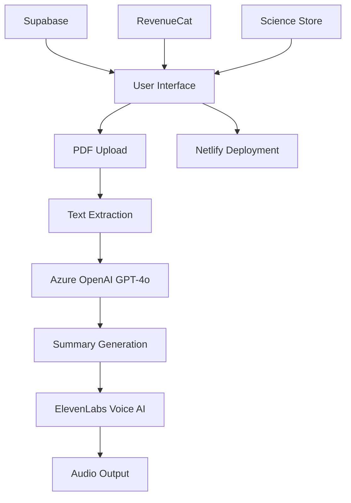

# EduSummarize - Voice-Powered PDF Summarization App


## 🎓 Overview

EduSummarize is a cutting-edge educational technology platform that transforms the way students learn by converting PDF documents into engaging audio summaries using advanced AI technology. Built for the Bolt Hackathon, this application combines multiple powerful technologies to create a seamless learning experience.

## ✨ Features

### Core Functionality
- **📄 PDF Upload & Processing**: Drag-and-drop PDF upload with automatic text extraction
- **🤖 AI Summarization**: Powered by Azure OpenAI GPT-4o for intelligent content summarization
- **🔊 Voice Generation**: Natural speech synthesis using ElevenLabs AI voice technology
- **🎙️ Conversational AI**: Interactive voice conversations (coming soon)
- **🔐 User Authentication**: Secure login and user management via Supabase
- **💰 Subscription Management**: Flexible pricing tiers managed by RevenueCat
- **🛍️ Science Store**: Educational tools and science kits marketplace

### User Experience
- **📱 Responsive Design**: Optimized for desktop, tablet, and mobile devices
- **🎨 Premium UI/UX**: Apple-level design aesthetics with smooth animations
- **⚡ Real-time Processing**: Instant feedback and processing status updates
- **💾 Offline Access**: Download audio summaries for offline listening

## 🛠️ Technology Stack

### Frontend
- **React 18** with TypeScript
- **Tailwind CSS** for styling
- **Framer Motion** for animations
- **React Router** for navigation
- **Vite** for build tooling

### Backend Services
- **Azure OpenAI GPT-4o** - AI summarization
- **ElevenLabs** - Voice synthesis and conversational AI
- **Supabase** - Authentication and database
- **RevenueCat** - Subscription management
- **PDF.js** - PDF text extraction

### Deployment
- **Netlify** - Hosting and continuous deployment

## 🚀 Getting Started

### Prerequisites
- Node.js 18+ 
- npm or yarn package manager

### Installation

1. **Clone the repository**
   ```bash
   git clone <repository-url>
   cd edutech-voice-pdf-app
   ```

2. **Install dependencies**
   ```bash
   npm install
   ```

3. **Start development server**
   ```bash
   npm run dev
   ```

4. **Open your browser**
   Navigate to `http://localhost:5173`

### Environment Setup

The application uses the following pre-configured API keys for the hackathon demonstration:

- **Azure OpenAI**: Integrated for GPT-4o summarization
- **ElevenLabs**: Voice synthesis with Rachel's voice
- **Supabase**: User authentication and data storage
- **RevenueCat**: Subscription management

## 📁 Project Structure

```
src/
├── components/          # Reusable UI components
│   ├── Navbar.tsx
│   └── BoltBadge.tsx
├── contexts/           # React contexts
│   └── AuthContext.tsx
├── pages/             # Application pages
│   ├── Dashboard.tsx
│   ├── Upload.tsx
│   ├── Summarize.tsx
│   ├── Voice.tsx
│   ├── Store.tsx
│   ├── Sponsors.tsx
│   ├── Auth.tsx
│   └── Paywall.tsx
├── services/          # API integrations
│   ├── openai.ts
│   ├── elevenlabs.ts
│   ├── supabase.ts
│   └── pdf.ts
└── App.tsx           # Main application component
```

## 🎯 Usage Guide

### 1. Upload PDFs
- Navigate to the Upload page
- Drag and drop PDF files or click to browse
- Wait for automatic text extraction

### 2. Generate Summaries
- Go to the Summarize page
- Paste extracted text or enter custom content
- Choose summary length (short, medium, detailed)
- Click "Generate Summary" for AI-powered summarization

### 3. Listen with Voice AI
- Visit the Voice page
- Enter text or use a generated summary
- Click "Generate Speech" for natural voice synthesis
- Play, pause, and download audio files

### 4. Explore the Science Store
- Browse educational tools and science kits
- Filter by category (Chemistry, Physics, Biology, etc.)
- Add items to cart for educational enhancement

## 🏆 Hackathon Challenges Addressed

This project addresses multiple Bolt Hackathon challenges:

- **🎤 Voice AI Challenge**: ElevenLabs integration for speech synthesis and conversational AI
- **💰 Make More Money Challenge**: RevenueCat subscription management and science store
- **🚀 Deploy Challenge**: Netlify hosting with continuous deployment
- **🏢 Startup Challenge**: Complete EdTech solution with monetization strategy

## 🤝 Sponsors & Partners

We're grateful to our amazing sponsors who made this project possible:

- **[RevenueCat](https://revenuecat.com)** - Subscription management platform
- **[Supabase](https://supabase.com)** - Backend-as-a-Service platform  
- **[ElevenLabs](https://elevenlabs.io)** - AI voice technology
- **[Netlify](https://netlify.com)** - Web hosting and deployment
- **[Bolt](https://bolt.new)** - AI-powered development platform

## 📊 Architecture Overview



## 🎥 Demo & Presentation

- **Live Demo**: [Coming Soon - Deployment URL]
- **Presentation**: Available in `/docs/presentation.html`
- **Sponsors Page**: [/sponsors](./src/pages/Sponsors.tsx)

## 📈 Future Enhancements

- Real-time voice conversations with ElevenLabs Conversational AI
- Multi-language support for global accessibility
- Integration with learning management systems (LMS)
- Advanced analytics and learning insights
- Collaborative study features
- Mobile app development

## 🏅 Hackathon Badge

This project proudly displays the Bolt Hackathon badge, showcasing our participation in this innovative developer challenge.


## 📄 License

This project was created for the Bolt Hackathon and is available for educational and demonstration purposes.

## 🔗 Links

- **Bolt Platform**: [https://bolt.new](https://bolt.new)
- **Hackathon Info**: [Bolt Hackathon Details]
- **Live Demo**: [Coming Soon]

---

Built with ❤️ for the Bolt Hackathon - Empowering learners through AI-powered education technology.